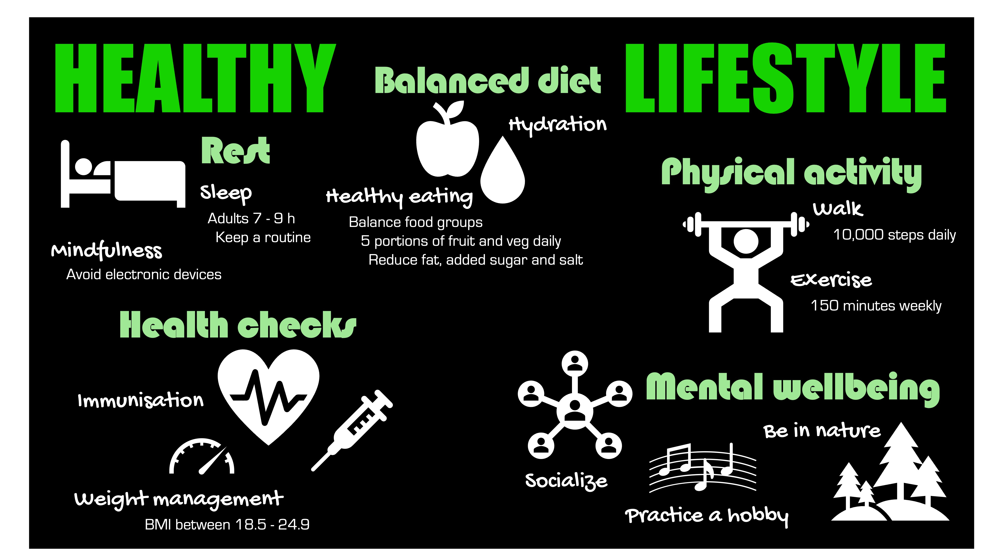
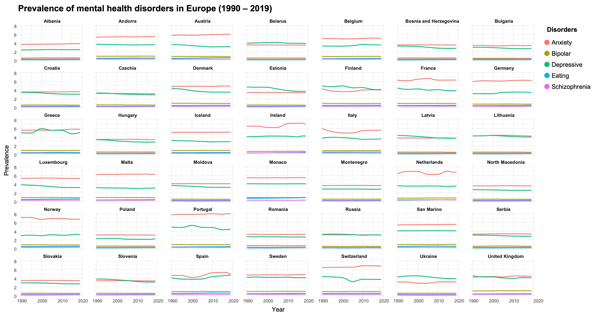
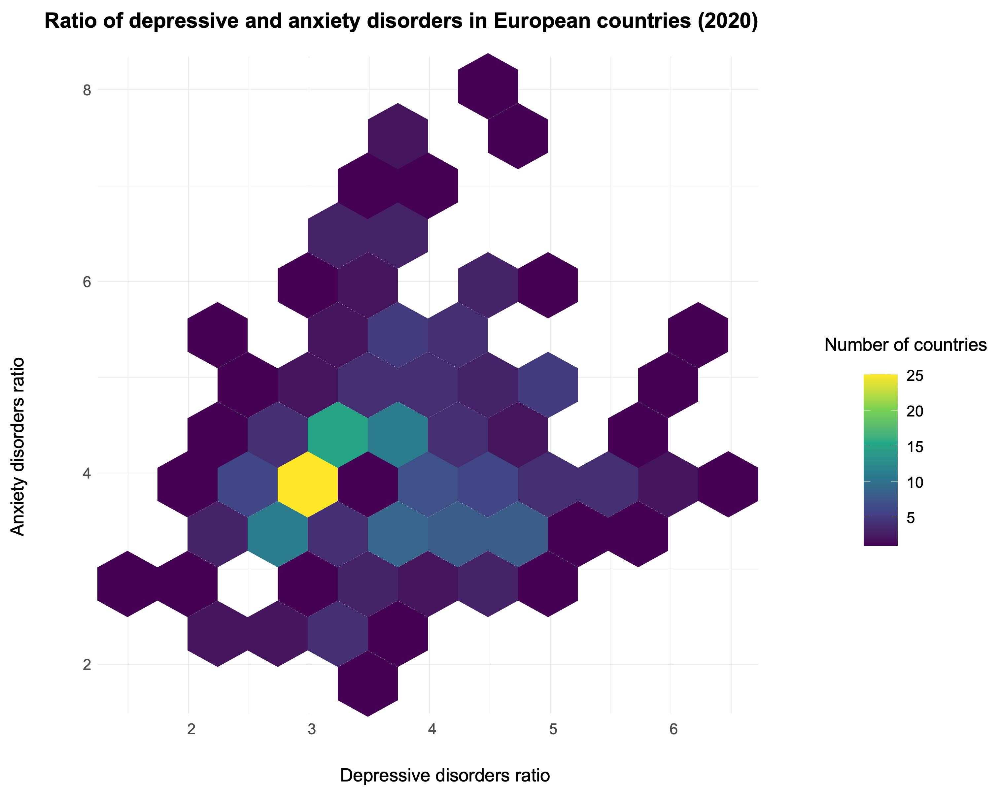

# Static infographic
Para esta visualización se obtuvieron datos sobre hábitos saludables del NHS (National Health Service) de Reino Unido.
 

Esta infografía representa los principales hábitos para mantener un estilo de vida saludable según el NHS. Se resaltan cinco áreas clave: alimentación equilibrada, actividad física, bienestar mental, revisiones médicas y descanso.
El objetivo es comunicar de forma clara y accesible pautas de salud preventiva, utilizando una estructura visual que facilita la comprensión inmediata.

## Fuentes
- https://www.nhs.uk/live-well/
- https://www.nhs.uk/better-health/
- https://www.nhsinform.scot/healthy-living/
- https://www.nhs.uk/every-mind-matters/mental-wellbeing-tips/how-to-fall-asleep-faster-and-sleep-better/

---

# Small multiple
Para esta visualización se obtuvieron datos sobre la prevalencia de ciertos trastornos mentales desde 1990 hasta 2019 de kaggle. Se filtró el dataset para Europa, y se dividieron los gráficos por países.

Esta visualización muestra la evolución temporal de distintos trastornos mentales (ansiedad, depresión, bipolaridad, trastornos alimentarios y esquizofrenia) en países europeos entre 1990 y 2019.
Cada pequeño gráfico permite comparar tendencias entre países de manera uniforme y detectar patrones o variaciones en la prevalencia.
El uso de small multiples y la segmentación temporal facilitan la comparación visual directa. El objetivo es concienciar sobre la existencia, y en algunos casos aumentos, de estos trastornos en la población.

## Fuente
https://www.kaggle.com/datasets/imtkaggleteam/mental-health

---

# Hexagonal binning
Para esta visualización se usó el mismo dataset que en el apartado anterior. En este caso, se filtró por año para seleccionar solo datos pertenecientes a 2019, y se representaron datos sobre las tasas de ansiedad y depresión.

En esta visualización se representan los ratios de depresión y ansiedad en 2019 en países de todo el mundo.
Los hexágonos se colorean según el número de países dentro de cada rango, lo que permite identificar concentraciones y correlaciones entre ambos trastornos. El objetivo de la visualización es concienciar sobre la prevalencia de tasas medias en la mayoría de los países, mostrando que estos trastornos afectan de forma generalizada a la población.

## Fuente
https://www.kaggle.com/datasets/imtkaggleteam/mental-health

---
